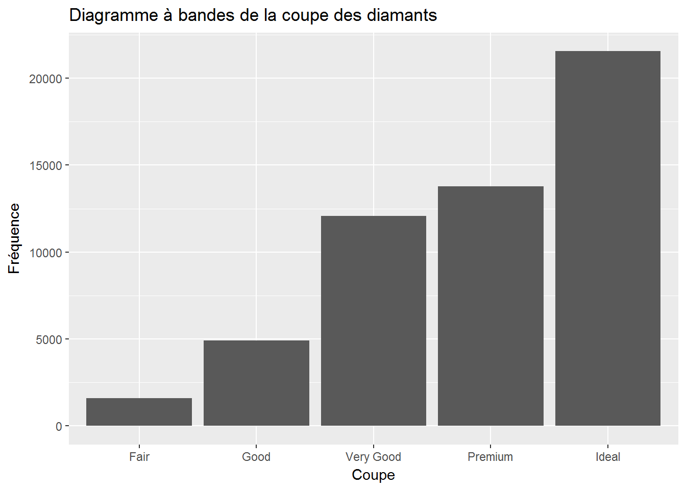
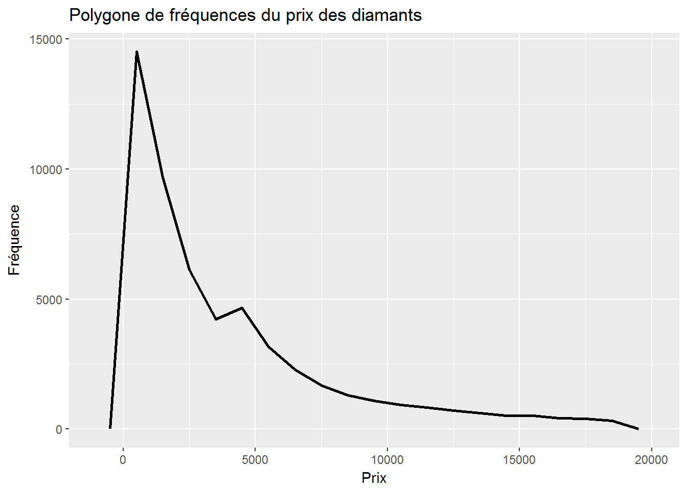
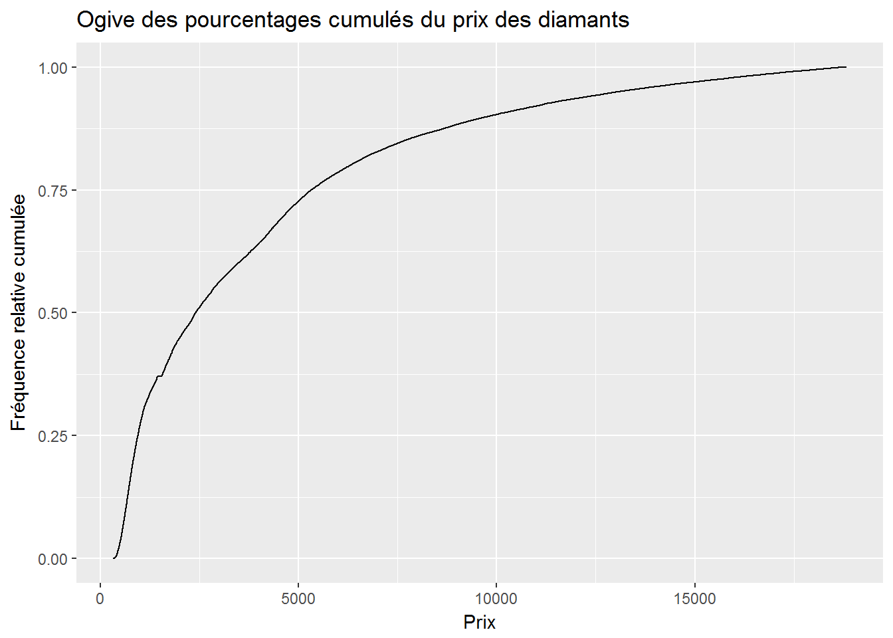
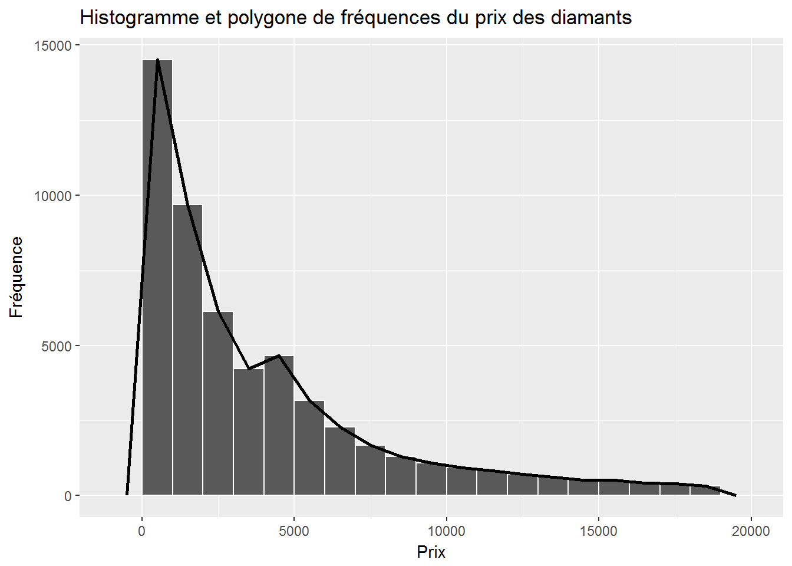

# Présentation des données

Pour débuter, nous allons charger les paquetages utiles:


```r
library(dplyr)
library(ggplot2)
library(knitr)
```

Pour introduire la présentation des données, nous allons utiliser la base de données `mtcars` et la base de données `diamonds`, que nous avons utilisé à la section \@ref(donneesdiamonds). 

La base de données `mtcars` a été extraite du magazine Motor Trend de l'année 1974, et comprend la consommation d'essence et 10 autres aspects de design automobile pour 32 automobiles (modèles 1973-1974). 

Les 11 variables de cette base de données sont:

- `mpg` : Miles/ (US) gallon
- `cyl` : Nombre de cylindres
- `disp` : Déplacement en pouces cube
- `hp` : Nombre de chevaux-vapeur
- `drat` : Ratio
- `wt` : Poids (1000 livres)
- `qsec` : Temps pour le quart de mile
- `vs` : V/S
- `am` : Transmission (0 = automatique, 1 = manuelle)
- `gear` : Nombre de vitesses
- `carb` : Nombre de carburateurs


```r
mtcars
```

```
##                      mpg cyl  disp  hp drat    wt  qsec vs am gear carb
## Mazda RX4           21.0   6 160.0 110 3.90 2.620 16.46  0  1    4    4
## Mazda RX4 Wag       21.0   6 160.0 110 3.90 2.875 17.02  0  1    4    4
## Datsun 710          22.8   4 108.0  93 3.85 2.320 18.61  1  1    4    1
## Hornet 4 Drive      21.4   6 258.0 110 3.08 3.215 19.44  1  0    3    1
## Hornet Sportabout   18.7   8 360.0 175 3.15 3.440 17.02  0  0    3    2
## Valiant             18.1   6 225.0 105 2.76 3.460 20.22  1  0    3    1
## Duster 360          14.3   8 360.0 245 3.21 3.570 15.84  0  0    3    4
## Merc 240D           24.4   4 146.7  62 3.69 3.190 20.00  1  0    4    2
## Merc 230            22.8   4 140.8  95 3.92 3.150 22.90  1  0    4    2
## Merc 280            19.2   6 167.6 123 3.92 3.440 18.30  1  0    4    4
## Merc 280C           17.8   6 167.6 123 3.92 3.440 18.90  1  0    4    4
## Merc 450SE          16.4   8 275.8 180 3.07 4.070 17.40  0  0    3    3
## Merc 450SL          17.3   8 275.8 180 3.07 3.730 17.60  0  0    3    3
## Merc 450SLC         15.2   8 275.8 180 3.07 3.780 18.00  0  0    3    3
## Cadillac Fleetwood  10.4   8 472.0 205 2.93 5.250 17.98  0  0    3    4
## Lincoln Continental 10.4   8 460.0 215 3.00 5.424 17.82  0  0    3    4
## Chrysler Imperial   14.7   8 440.0 230 3.23 5.345 17.42  0  0    3    4
## Fiat 128            32.4   4  78.7  66 4.08 2.200 19.47  1  1    4    1
## Honda Civic         30.4   4  75.7  52 4.93 1.615 18.52  1  1    4    2
## Toyota Corolla      33.9   4  71.1  65 4.22 1.835 19.90  1  1    4    1
## Toyota Corona       21.5   4 120.1  97 3.70 2.465 20.01  1  0    3    1
## Dodge Challenger    15.5   8 318.0 150 2.76 3.520 16.87  0  0    3    2
## AMC Javelin         15.2   8 304.0 150 3.15 3.435 17.30  0  0    3    2
## Camaro Z28          13.3   8 350.0 245 3.73 3.840 15.41  0  0    3    4
## Pontiac Firebird    19.2   8 400.0 175 3.08 3.845 17.05  0  0    3    2
## Fiat X1-9           27.3   4  79.0  66 4.08 1.935 18.90  1  1    4    1
## Porsche 914-2       26.0   4 120.3  91 4.43 2.140 16.70  0  1    5    2
## Lotus Europa        30.4   4  95.1 113 3.77 1.513 16.90  1  1    5    2
## Ford Pantera L      15.8   8 351.0 264 4.22 3.170 14.50  0  1    5    4
## Ferrari Dino        19.7   6 145.0 175 3.62 2.770 15.50  0  1    5    6
## Maserati Bora       15.0   8 301.0 335 3.54 3.570 14.60  0  1    5    8
## Volvo 142E          21.4   4 121.0 109 4.11 2.780 18.60  1  1    4    2
```

## Variables qualitatives

### Tableaux de fréquences

Nous pouvons représenter des variables qualitatives sous forme de tableau. Nous allons utiliser la commande `tabfreq`. Voici comment l'utiliser pour représenter la variable `cut` de la base de données `diamonds`.


```r
tabfreq(diamonds$cut)
```


diamonds$cut    Fréquence    Fréquence relative    Fréquence relative cumulée 
-------------  -----------  --------------------  ----------------------------
Fair              1610             0.030                     0.030            
Good              4906             0.091                     0.121            
Very Good         12082            0.224                     0.345            
Premium           13791            0.256                     0.600            
Ideal             21551            0.400                     1.000            
Total             53940            1.000                     1.000            

Nous pouvons également étudier la variable `clarity`.


```r
tabfreq(diamonds$clarity)
```


diamonds$clarity    Fréquence    Fréquence relative    Fréquence relative cumulée 
-----------------  -----------  --------------------  ----------------------------
I1                     741             0.014                     0.014            
SI2                   9194             0.170                     0.184            
SI1                   13065            0.242                     0.426            
VS2                   12258            0.227                     0.654            
VS1                   8171             0.151                     0.805            
VVS2                  5066             0.094                     0.899            
VVS1                  3655             0.068                     0.967            
IF                    1790             0.033                     1.000            
Total                 53940            1.000                     1.000            

### Diagramme à bandes

Pour les variables qualitatives, le diagramme à bandes est le graphique de choix.

Pour la variable `clarity`.


```r
ggplot(diamonds, aes(clarity)) + geom_bar() +
  labs(
    x = "Clarté", 
    y = "Fréquence", 
    title = "Diagramme à bandes de la clarté des diamants")
```


Pour la variable `cut`.


```r
ggplot(diamonds, aes(cut)) + geom_bar() +
  labs(
    x = "Coupe", 
    y = "Fréquence", 
    title = "Diagramme à bandes de la coupe des diamants")
```



### Diagramme circulaire


```r
ggplot(diamonds, aes(x = factor(1), fill = cut)) + 
  geom_bar() +
  coord_polar(theta = "y")
```


## Variables quantitatives

### Tableaux de fréquences {#freqquantitatives}

Pour une variable quantitative discrète, il suffit d'utiliser la fonction `tabfreq` pour représenter les données sous forme de tableau. Par exemple, pour la variable `cyl` de la base de données `mtcars`.


```r
tabfreq(mtcars$cyl)
```


mtcars$cyl    Fréquence    Fréquence relative    Fréquence relative cumulée 
-----------  -----------  --------------------  ----------------------------
4                11              0.344                     0.344            
6                 7              0.219                     0.562            
8                14              0.438                     1.000            
Total            32              1.000                     1.000            

Pour représenter une variable quantitative continue sous forme de tableau, il faut effectuer un traitement préalable sur les données. 

Étudions la variable `carat` de la base de données `diamonds`. Si  nous tentons d'utiliser la commande `tabfreq` directement, nous allons obtenir une table beaucoup trop grande. En effet, la variable `carat` possède 273 valeurs différentes!

Pour représenter la variable correctement, nous allons débuter par observer l'étendue des valeurs possibles de cette variable en utilisant la commande `range`. Nous avons donc:


```r
range(diamonds$carat)
```

```
## [1] 0.20 5.01
```

La sortie de `R` signifie que la valeur la plus petite de `carat` est 0.2, et que la plus grande est 5.01. 

Nous voulons maintenant recoder notre variable `carat` pour obtenir des classes. Dans notre exemple, il semble adéquat de créer des classes de largeur 1 en débutant à 0 et en terminant à 6. L'option `breaks` permet de décider des classes et l'option `right` permet de fermer l'intervalle à gauche et de l'ouvrir à droite.


```r
carat_class = cut(diamonds$carat,
                  breaks = seq(from = 0, to = 6, by = 1),
                  right = FALSE)
tabfreq(carat_class)
```


carat_class    Fréquence    Fréquence relative    Fréquence relative cumulée 
------------  -----------  --------------------  ----------------------------
[0,1)            34880            0.647                     0.647            
[1,2)            16906            0.313                     0.960            
[2,3)            2114             0.039                     0.999            
[3,4)             34              0.001                     1.000            
[4,5)              5              0.000                     1.000            
[5,6)              1              0.000                     1.000            
Total            53940            1.000                     1.000            

### Diagramme à bâtons

Pour les variables quantitatives discrètes, le diagramme à bâtons est le graphique de choix.


```r
ggplot(mtcars, aes(cyl)) + 
  geom_bar(width = 0.1) + 
  labs(
    x = "Nombre de cylindres", 
    y = "Fréquence", 
    title = "Diagramme à bâtons du nombre de cylindres")
```


### Histogramme

Pour les variables quantitatives discrètes, il est possible d'utiliser l'histogramme.


```r
ggplot(diamonds, aes(price)) + 
  geom_histogram(color = "white",binwidth = 1000, center = 500) +
  labs(
    x = "Prix", 
    y = "Fréquence", 
    title = "Histogramme du prix des diamants")
```


### Polygone de fréquences

Pour les variables quantitatives discrètes, il est possible d'utiliser le polygone de fréquences.


```r
ggplot(diamonds, aes(price)) + 
  geom_freqpoly(size = 1,binwidth = 1000, center = 500) + 
  labs(
    x = "Prix", 
    y = "Fréquence", 
    title = "Polygone de fréquences du prix des diamants")
```



### Ogive des pourcentages cumulés

Pour les variables quantitatives discrètes, il est possible d'utiliser l'ogive des pourcentages cumulés.


```r
ggplot(diamonds, aes(price)) + 
  stat_ecdf(pad = FALSE) + 
  labs(
    x = "Prix", 
    y = "Fréquence relative cumulée", 
    title = "Ogive des pourcentages cumulés du prix des diamants")
```



### Histogramme et polygone de fréquences

Pour les variables quantitatives discrètes, il est possible d'utiliser l'histogramme et le polygone de fréquences.


```r
ggplot(diamonds, aes(price)) + 
  geom_histogram(color = "white",,binwidth = 1000, center = 500) + 
  geom_freqpoly(size = 1,,binwidth = 1000, center = 500) + 
  labs(
    x = "Prix", 
    y = "Fréquence", 
    title = "Histogramme et polygone de fréquences du prix des diamants")
```


